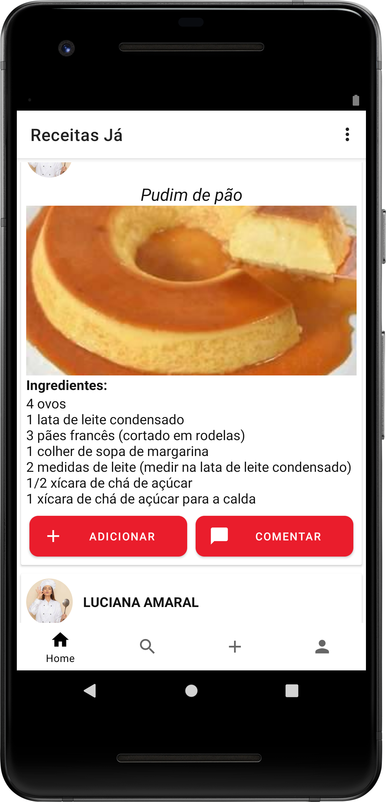
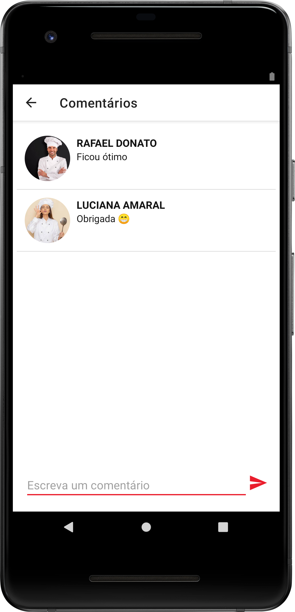
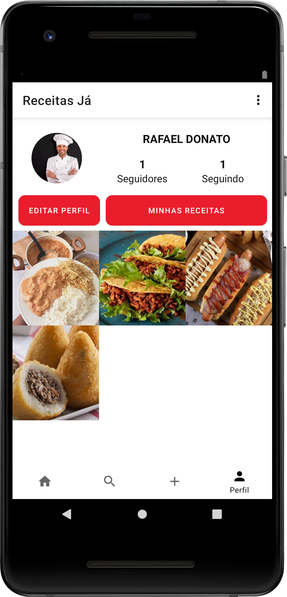
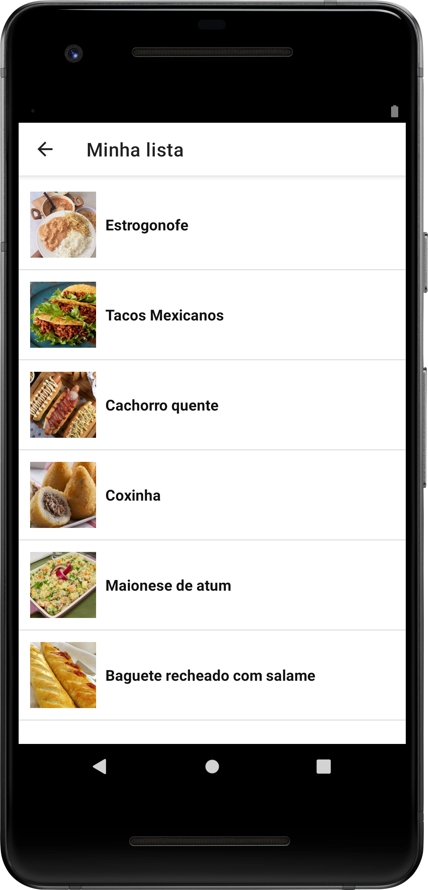
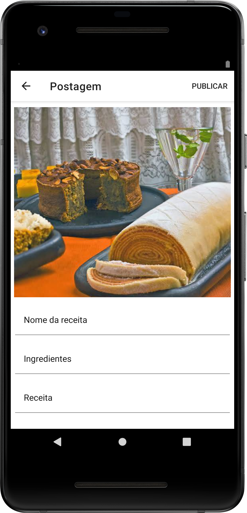

# Receitas Já

  

## 🍕🍔🍟 Sobre o app

O Receitas Já é uma rede social focada para o público culinário, através dela é possível compartilhar suas receitas com seus seguidores, e acompanhar as postagens daqueles seus cozinheiros preferidos.

## 📚📖 Objetivo

Desenvolvido como trabalho final da disciplina de dispositivos móveis 2, onde o objetivo era criar uma ideia autoral de uma aplicação que seria possível ser alimentada através dos próprios usuários.

## 👨‍💻 Tecnologias

- Java
- [Firebase](https://firebase.google.com/?authuser=0)

## 🎨 Layout e telas

  <h2>📱 Página principal</h2>
  
Aqui ficará as postagens dos usuários e cada post tem suas informações, como nome e ingredientes, com opção de comentar o post ou adicionar aquela receita a sua lista.

  

  <h2>📱 Página de detalhes do post</h2>
  
Cada postagem tem como ver seus detalhes, como comentários e o modo como é preparado e todos os ingredientes.

  

  <h2>📱 Página de comentários</h2>
  
É possível fazer comentários nas receitas dos outros usuários, pedindo dicas e tirando dúvidas.

  

  <h2>📱 Página de perfil do usuários </h2>
  
Ficará armazenado todas as receitas publicadas em seu perfil, com nome e foto e seus seguidores/seguindo, com botão para acessar sua lista personalizada de receitas.

  

  <h2>📱 Página de lista de receitas do usuário </h2>
  
Todas receitas que deseja adicionar a sua lista personalizada, onde ficará salvo os posts que mais interessar.

  

  <h2>📱 Página de postagem</h2>
  
Local onde é realizado as postagens das receitas, com a foto da receita, nome, ingredientes e como preparar.

  

